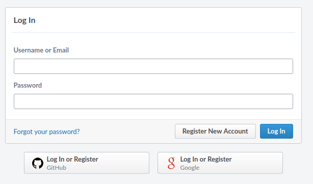
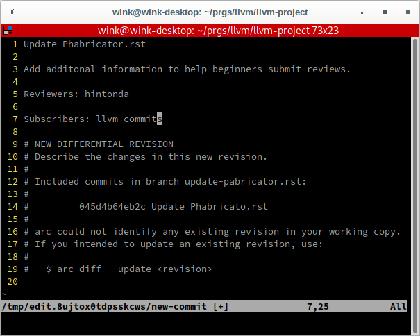
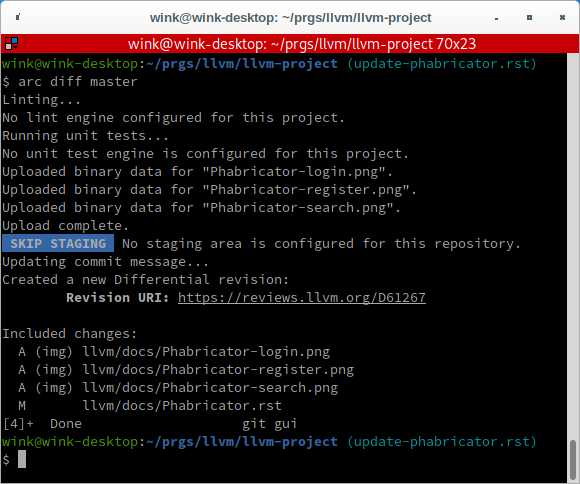
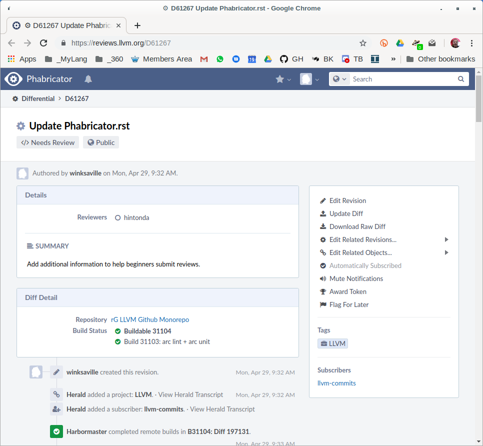

.. _phabricator-reviews:

=============================
Code Reviews with Phabricator
=============================

.. contents::
  :local:

If you prefer to use a web user interface for code reviews, you can now submit
your patches for Clang and LLVM at `LLVM's Phabricator`_ instance.

While Phabricator is a useful tool for some, the relevant -commits mailing list
is the system of record for all LLVM code review. The mailing list should be
added as a subscriber on all reviews, and Phabricator users should be prepared
to respond to free-form comments in mail sent to the commits list.

Sign up
-------

To get started with Phabricator, navigate to `https://reviews.llvm.org`_ and
click the Log In button in the top right side:

Then Register New Account:

Use GitHub, Google or create a Phabricator profile by clicking on appropriate
button above.

Make *sure* that the email address registered with Phabricator is subscribed
to the relevant -commits mailing list. If you are not subscribed to the commit
list, all mail sent by Phabricator on your behalf will be held for moderation.

Note that if you use your Subversion user name as Phabricator user name,
Phabricator will automatically connect your submits to your Phabricator user in
the `Code Repository Browser`_.

.. _phabricator-request-review-command-line:

Requesting a review via the command line
----------------------------------------

Phabricator has a tool called *Arcanist* to upload patches from
the command line. To get you set up, follow the
`Arcanist Quick Start`_ instructions.

There are many possible workflows for creating changes, what follows is
one possibility.

First create a branch off commit, tag or another branch like master. For a
new feature this would typically be off the **master**. Then edit/create files,
compile, test and commit the changes:

::

   git checkout -b update-phabricator.rst master
   vi llvm/docs/phabricator.rst
   ...
   git commit -a -m "Update Phabricator.rst"

|

Before uploading for review you need to find your initial reviewers,
finding-potential-reviewers_. Then use ``arc diff`` to upload commits to
Differential, the web based Phabricator code review tool. When ``arc diff``
runs it will use your editor (see set-arc-editor_) so you can supply ``Reviewers``
and ``Subscribers`` in your commit message. ``arc`` requires one or more
Reviewers (finding-reviewer-names_) and Subscribers should be the appropriate
**-commits** list(s) from `listinfo <https://lists.llvm.org/mailman/listinfo>`_.
If you are working off a clone of the official https://github.com/llvm/llvm-project/
repository, Phabricator will provide the correct lists automatically for
Subscribers. Otherwise, please add the relevant ones yourself."

::

  arc diff master

|

Here is the editor running allowing you to edit your commit message. A
summary message and reviewer has been added and its ready to be written.

|

After writing and quitting the editor you'll see a summary of what ``arc`` did:

|

You can now navigate to the `Differential revision` at
`<https://reviews.llvm.org/D61267>`_.

|

See `Arcanist diff <https://secure.phabricator.com/book/phabricator/article/arcanist\_diff>`_
documentation and more about interacting with Phabricator in the `Arcanist User Guide`_.

.. _phabricator-request-review-web:

Requesting a review via the web interface
-----------------------------------------

The tool to create and review patches in Phabricator is called
*Differential*.

Note that you can upload patches created through various diff tools,
including git and svn. To make reviews easier, please always include
**as much context as possible** with your diff! Don't worry, Phabricator
will automatically send a diff with a smaller context in the review
email, but having the full file in the web interface will help the
reviewer understand your code.

To get a full diff, use one of the following commands (or just use Arcanist
to upload your patch):

* ``git show HEAD -U999999 > mypatch.patch``
* ``git format-patch -U999999 @{u}``
* ``svn diff --diff-cmd=diff -x -U999999``

To upload a new patch:

* Click *Differential*.
* Click *+ Create Diff*.
* Paste the text diff or browse to the patch file. Click *Create Diff*.
* Leave this first Repository field blank. (We'll fill in the Repository
  later, when sending the review.)
* Leave the drop down on *Create a new Revision...* and click *Continue*.
* Enter a descriptive title and summary.  The title and summary are usually
  in the form of a :ref:`commit message <commit messages>`.
* Add reviewers (see below for advice). (If you set the Repository field
  correctly, llvm-commits or cfe-commits will be subscribed automatically;
  otherwise, you will have to manually subscribe them.)
* In the Repository field, enter the name of the project (LLVM, Clang,
  etc.) to which the review should be sent.
* Click *Save*.

To submit an updated patch:

* Click *Differential*.
* Click *+ Create Diff*.
* Paste the updated diff or browse to the updated patch file. Click *Create Diff*.
* Select the review you want to from the *Attach To* dropdown and click
  *Continue*.
* Leave the Repository field blank. (We previously filled out the Repository
  for the review request.)
* Add comments about the changes in the new diff. Click *Save*.

Choosing reviewers: You typically pick one or two people as initial reviewers.
This choice is not crucial, because you are merely suggesting and not requiring
them to participate. Many people will see the email notification on cfe-commits
or llvm-commits, and if the subject line suggests the patch is something they
should look at, they will.

.. _finding-potential-reviewers:

Finding potential reviewers
---------------------------

Here are a couple of ways to pick the initial reviewer(s):

* Use :ref:`arc cover<arc-cover>`, ``git blame`` or the commit log to find names
  of people who have recently modified the same area of code that you are modifying.
* Look in CODE_OWNERS.TXT to see who might be responsible for that area.
* If you've discussed the change on a dev list, the people who participated
  might be appropriate reviewers.

Even if you think the code owner is the busiest person in the world, it's still
okay to put them as a reviewer. Being the code owner means they have accepted
responsibility for making sure the review happens.

.. _finding-reviewer-names:

Finding Reviewers Names
-----------------------

The names for Reviewers and Subscribers is the user name registered at
`<https://reviews.llvm.org>`_. Use the search box and type some or all of
the persons "real name" or possibly their email name (which might be their
username).

.. _set-arc-editor:

Set arc Editor
--------------

The default editor for ``arc diff`` is nano on Linux, if you have a
favorite editor you can set it globally using ``arc set-config``:

::

  $ arc set-config editor vim
  Set key "editor" = "vim" in user config (was null).

|

Or the current project passing ``--local``:

::

  $ arc set-config --local editor vim
  Set key "editor" = "vim" in local config (was null).

|

For help execute: ``arc help set-config``.

.. _arc-cover:

Arc cover
---------

``arc cover`` uses blame information to identify the names associated with
modified lines. If you want to look at a particular file:

::

  $ arc cover llvm/docs/Phabricator
  Reid Kleckner
    llvm/docs/Phabricator.rst: lines 22-23
  Sanjay Patel
    llvm/docs/Phabricator.rst: line 24
  Manuel Klimek
    llvm/docs/Phabricator.rst: lines 32-33, 40-41, 116-117
  Florian Hahn
    llvm/docs/Phabricator.rst: line 42
  Paul Robinson
    llvm/docs/Phabricator.rst: lines 107-108

|

Or if you've created a commit you can provide a revision:

::

  $ arc cover --rev master
  Reid Kleckner
    llvm/docs/Phabricator.rst: lines 22-23
  Sanjay Patel
    llvm/docs/Phabricator.rst: line 24
  Manuel Klimek
    llvm/docs/Phabricator.rst: lines 32-33, 40-41, 116-117
  Florian Hahn
    llvm/docs/Phabricator.rst: line 42
  Paul Robinson
    llvm/docs/Phabricator.rst: lines 107-108

|

For help execute: ``arc help cover``.

Reviewing code with Phabricator
-------------------------------

Phabricator allows you to add inline comments as well as overall comments
to a revision. To add an inline comment, select the lines of code you want
to comment on by clicking and dragging the line numbers in the diff pane.
When you have added all your comments, scroll to the bottom of the page and
click the Submit button.

You can add overall comments in the text box at the bottom of the page.
When you're done, click the Submit button.

Phabricator has many useful features, for example allowing you to select
diffs between different versions of the patch as it was reviewed in the
*Revision Update History*. Most features are self descriptive - explore, and
if you have a question, drop by on #llvm in IRC to get help.

Note that as e-mail is the system of reference for code reviews, and some
people prefer it over a web interface, we do not generate automated mail
when a review changes state, for example by clicking "Accept Revision" in
the web interface. Thus, please type LGTM into the comment box to accept
a change from Phabricator.

Committing a change
-------------------

Once a patch has been reviewed and approved on Phabricator it can then be
committed to trunk. If you do not have commit access, someone has to
commit the change for you (with attribution). It is sufficient to add
a comment to the approved review indicating you cannot commit the patch
yourself. If you have commit access, there are multiple workflows to commit the
change. Whichever method you follow it is recommended that your commit message
ends with the line:

::

  Differential Revision: <URL>

where ``<URL>`` is the URL for the code review, starting with
``https://reviews.llvm.org/``.

This allows people reading the version history to see the review for
context. This also allows Phabricator to detect the commit, close the
review, and add a link from the review to the commit.

Note that if you use the Arcanist tool the ``Differential Revision`` line will
be added automatically. If you don't want to use Arcanist, you can add the
``Differential Revision`` line (as the last line) to the commit message
yourself.

Using the Arcanist tool can simplify the process of committing reviewed code as
it will retrieve reviewers, the ``Differential Revision``, etc from the review
and place it in the commit message. You may also commit an accepted change
directly using ``git llvm push``, per the section in the :ref:`getting started
guide <commit_from_git>`.

Note that if you commit the change without using Arcanist and forget to add the
``Differential Revision`` line to your commit message then it is recommended
that you close the review manually. In the web UI, under "Leap Into Action" put
the SVN revision number in the Comment, set the Action to "Close Revision" and
click Submit.  Note the review must have been Accepted first.

Committing someone's change from Phabricator
^^^^^^^^^^^^^^^^^^^^^^^^^^^^^^^^^^^^^^^^^^^^

On a clean Git repository on an up to date ``master`` branch run the
following (where ``<Revision>`` is the Phabricator review number):

::

  arc patch D<Revision>

This will create a new branch called ``arcpatch-D<Revision>`` based on the
current ``master`` and will create a commit corresponding to ``D<Revision>`` with a
commit message derived from information in the Phabricator review.

Check you are happy with the commit message and amend it if necessary. Then,
make sure the commit is up-to-date, and commit it. This can be done by running
the following:

::

  git pull --rebase origin master
  git show # Ensure the patch looks correct.
  ninja check-$whatever # Rerun the appropriate tests if needed.
  git llvm push

Subversion and Arcanist (deprecated)
^^^^^^^^^^^^^^^^^^^^^^^^^^^^^^^^^^^^

To download a change from Phabricator and commit it with subversion, you should
first make sure you have a clean working directory. Then run the following
(where ``<Revision>`` is the Phabricator review number):

::

  arc patch D<Revision>
  arc commit --revision D<Revision>

The first command will take the latest version of the reviewed patch and apply
it to the working copy. The second command will commit this revision to trunk.

Abandoning a change
-------------------

If you decide you should not commit the patch, you should explicitly abandon
the review so that reviewers don't think it is still open. In the web UI,
scroll to the bottom of the page where normally you would enter an overall
comment. In the drop-down Action list, which defaults to "Comment," you should
select "Abandon Revision" and then enter a comment explaining why. Click the
Submit button to finish closing the review.

Status
------

Please let us know whether you like it and what could be improved! We're still
working on setting up a bug tracker, but you can email klimek-at-google-dot-com
and chandlerc-at-gmail-dot-com and CC the llvm-dev mailing list with questions
until then. We also could use help implementing improvements. This sadly is
really painful and hard because the Phabricator codebase is in PHP and not as
testable as you might like. However, we've put exactly what we're deploying up
on an `llvm-reviews GitHub project`_ where folks can hack on it and post pull
requests. We're looking into what the right long-term hosting for this is, but
note that it is a derivative of an existing open source project, and so not
trivially a good fit for an official LLVM project.

.. _LLVM's Phabricator: https://reviews.llvm.org
.. _`https://reviews.llvm.org`: https://reviews.llvm.org
.. _Code Repository Browser: https://reviews.llvm.org/diffusion/
.. _Arcanist Quick Start: https://secure.phabricator.com/book/phabricator/article/arcanist_quick_start/
.. _Arcanist User Guide: https://secure.phabricator.com/book/phabricator/article/arcanist/
.. _llvm-reviews GitHub project: https://github.com/r4nt/llvm-reviews/
